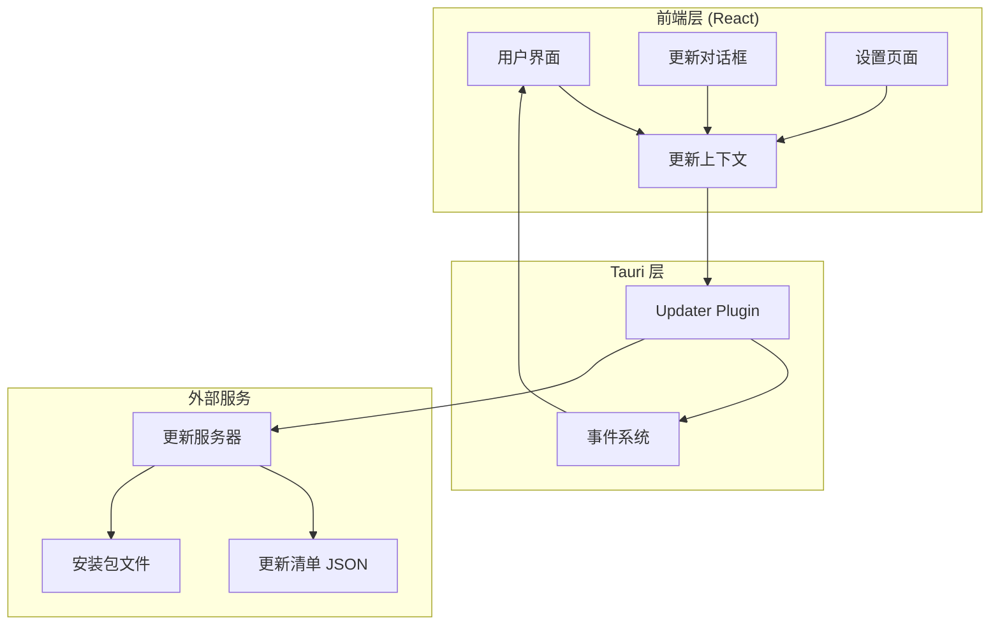
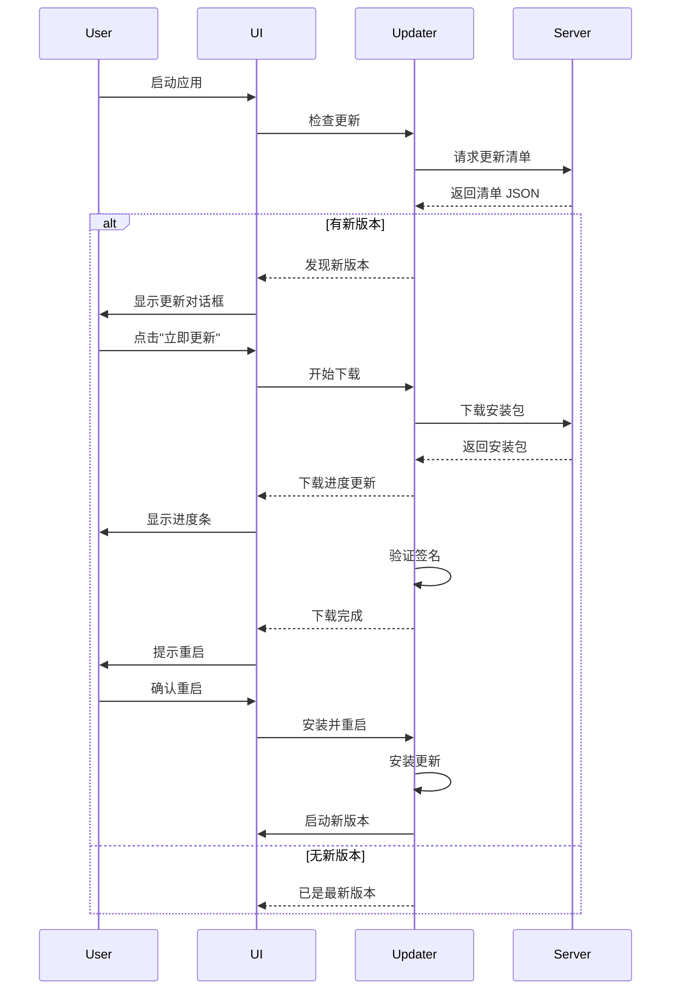

# 自动更新功能设计文档

## 概述

本设计文档描述了为 fanyifanyi Tauri 应用实现自动更新功能的技术方案。该方案基于 Tauri 2.x 官方的 `tauri-plugin-updater` 插件，提供跨平台的自动更新能力。

### 核心目标

- 使用 Tauri 官方更新插件实现自动更新
- 提供用户友好的更新通知和进度显示
- 确保更新过程的安全性和可靠性
- 支持 Windows、macOS 和 Linux 平台
- 在设置页面集成更新管理功能

## 架构

### 系统架构图



### 更新流程



## 组件和接口

### 1. Rust 后端组件

#### 1.1 Updater 插件配置

在 `src-tauri/Cargo.toml` 中添加依赖：

```toml
[dependencies]
tauri-plugin-updater = "2"
```

在 `src-tauri/src/lib.rs` 中注册插件：

```rust
use tauri_plugin_updater::UpdaterExt;

pub fn run() {
    tauri::Builder::default()
        .plugin(tauri_plugin_updater::Builder::new().build())
        .setup(|app| {
            // 可选：在启动时检查更新
            Ok(())
        })
        .run(tauri::generate_context!())
        .expect("error while running tauri application");
}
```

#### 1.2 Tauri 配置

在 `src-tauri/tauri.conf.json` 中配置更新器：

```json
{
  "bundle": {
    "active": true,
    "targets": "all",
    "publisher": "Your Name",
    "updater": {
      "active": true,
      "endpoints": [
        "https://your-update-server.com/{{target}}/{{current_version}}"
      ],
      "pubkey": "YOUR_PUBLIC_KEY_HERE"
    }
  }
}
```

### 2. 前端组件

#### 2.1 更新上下文 (UpdateContext)

**文件**: `src/contexts/UpdateContext.tsx`

提供全局更新状态管理和 API。

```typescript
interface UpdateInfo {
  version: string
  date: string
  body: string
}

interface UpdateContextType {
  // 状态
  updateAvailable: boolean
  updateInfo: UpdateInfo | null
  downloading: boolean
  downloadProgress: number
  error: string | null
  lastChecked: Date | null

  // 方法
  checkForUpdates: () => Promise<void>
  downloadAndInstall: () => Promise<void>
  dismissUpdate: () => void
}
```

**核心功能**:

- 封装 Tauri updater API 调用
- 管理更新状态（检查中、下载中、错误等）
- 提供更新检查和安装方法
- 处理更新事件和错误

#### 2.2 更新对话框组件

**文件**: `src/components/UpdateDialog.tsx`

显示更新通知和下载进度的对话框。

```typescript
interface UpdateDialogProps {
  open: boolean
  updateInfo: UpdateInfo | null
  downloading: boolean
  progress: number
  onUpdate: () => void
  onDismiss: () => void
}
```

**UI 元素**:

- 版本号显示
- 更新说明（changelog）
- 下载进度条
- "立即更新" 和 "稍后提醒" 按钮
- 错误提示

#### 2.3 设置页面更新部分

**文件**: `src/pages/Settings.tsx` (扩展现有文件)

在现有设置页面中添加更新管理部分。

**新增 UI 元素**:

- 当前版本号显示
- "检查更新" 按钮
- 最后检查时间显示
- 自动检查更新开关（可选）

### 3. 工具函数

#### 3.1 更新检查器

**文件**: `src/lib/updater.ts`

```typescript
import { relaunch } from '@tauri-apps/plugin-process'
import { check } from '@tauri-apps/plugin-updater'

export async function checkForUpdates() {
  const update = await check()
  return update
}

export async function downloadAndInstall(update: Update) {
  await update.downloadAndInstall()
  await relaunch()
}
```

#### 3.2 版本比较工具

**文件**: `src/lib/version.ts`

```typescript
export function compareVersions(v1: string, v2: string): number {
  // 实现语义化版本比较
}

export function formatVersion(version: string): string {
  // 格式化版本号显示
}
```

## 数据模型

### 更新清单格式

更新服务器返回的 JSON 格式：

```json
{
  "version": "0.2.0",
  "notes": "修复了若干 bug，添加了新功能",
  "pub_date": "2025-11-10T12:00:00Z",
  "platforms": {
    "darwin-x86_64": {
      "signature": "BASE64_SIGNATURE",
      "url": "https://your-server.com/fanyifanyi-0.2.0-x64.app.tar.gz"
    },
    "darwin-aarch64": {
      "signature": "BASE64_SIGNATURE",
      "url": "https://your-server.com/fanyifanyi-0.2.0-aarch64.app.tar.gz"
    },
    "linux-x86_64": {
      "signature": "BASE64_SIGNATURE",
      "url": "https://your-server.com/fanyifanyi-0.2.0-amd64.AppImage"
    },
    "windows-x86_64": {
      "signature": "BASE64_SIGNATURE",
      "url": "https://your-server.com/fanyifanyi-0.2.0-x64-setup.exe"
    }
  }
}
```

### 本地存储数据

使用 localStorage 存储更新相关配置：

```typescript
interface UpdateSettings {
  autoCheck: boolean
  lastChecked: string // ISO 8601 日期
  dismissedVersion: string | null
}
```

## 错误处理

### 错误类型

1. **网络错误**: 无法连接到更新服务器
2. **解析错误**: 更新清单格式错误
3. **验证错误**: 签名验证失败
4. **下载错误**: 下载中断或失败
5. **安装错误**: 安装过程失败

### 错误处理策略

```typescript
enum UpdateErrorType {
  NETWORK_ERROR = 'network_error',
  PARSE_ERROR = 'parse_error',
  VERIFICATION_ERROR = 'verification_error',
  DOWNLOAD_ERROR = 'download_error',
  INSTALL_ERROR = 'install_error',
}

interface UpdateError {
  type: UpdateErrorType
  message: string
  recoverable: boolean
}
```

**处理原则**:

- 网络错误：静默失败，不打扰用户
- 验证错误：显示警告，阻止安装
- 下载错误：允许重试
- 安装错误：提供回滚选项

## 测试策略

### 单元测试

1. **版本比较逻辑测试**
   - 测试不同版本号的比较结果
   - 测试边界情况（预发布版本、构建号等）

2. **更新状态管理测试**
   - 测试状态转换逻辑
   - 测试错误处理

### 集成测试

1. **更新流程测试**
   - 模拟完整的更新检查流程
   - 测试下载和安装流程
   - 测试用户交互

2. **错误场景测试**
   - 测试网络失败场景
   - 测试无效清单处理
   - 测试下载中断恢复

### 手动测试

1. **跨平台测试**
   - 在 Windows、macOS、Linux 上测试完整流程
   - 验证平台特定的安装机制

2. **用户体验测试**
   - 测试对话框显示和交互
   - 测试进度反馈
   - 测试错误提示

## 安全考虑

### 1. 签名验证

- 使用 Tauri 内置的签名验证机制
- 生成密钥对用于签名更新包
- 在配置中设置公钥

**密钥生成**:

```bash
# 使用 Tauri CLI 生成密钥对
tauri signer generate -w ~/.tauri/myapp.key
```

### 2. HTTPS 传输

- 所有更新请求必须使用 HTTPS
- 验证服务器证书
- 防止中间人攻击

### 3. 完整性检查

- 验证下载文件的 SHA-256 哈希
- 确保文件未被篡改

## 部署和发布流程

### 1. 构建发布版本

```bash
# 构建所有平台的安装包
pnpm tauri build

# 为更新包签名
tauri signer sign ./target/release/bundle/...
```

### 2. 生成更新清单

使用脚本自动生成更新清单 JSON：

```bash
# 示例脚本
node scripts/generate-update-manifest.js --version 0.2.0
```

### 3. 上传到更新服务器

- 上传签名后的安装包
- 上传更新清单 JSON
- 配置 CDN 加速（可选）

### 4. 更新服务器选项

**选项 1: GitHub Releases**

- 免费托管
- 自动生成下载链接
- 需要配置 GitHub Actions

**选项 2: 自建服务器**

- 完全控制
- 需要维护成本
- 可以使用 Nginx/Apache 提供静态文件服务

**选项 3: 云存储 (S3/OSS)**

- 高可用性
- CDN 加速
- 按使用量付费

## 性能优化

### 1. 增量更新（未来优化）

- 仅下载变更的文件
- 减少下载大小和时间

### 2. 后台下载

- 在用户使用应用时后台下载
- 不阻塞用户操作

### 3. 断点续传

- 支持下载中断后继续
- 避免重复下载

## 配置选项

### 用户可配置项

```typescript
interface UpdatePreferences {
  autoCheckOnStartup: boolean // 启动时自动检查
  autoDownload: boolean // 自动下载更新
  notifyOnAvailable: boolean // 有更新时通知
  checkInterval: number // 检查间隔（小时）
}
```

### 开发者配置项

在 `tauri.conf.json` 中：

```json
{
  "bundle": {
    "updater": {
      "active": true,
      "endpoints": ["https://updates.example.com/{{target}}/{{current_version}}"],
      "dialog": false, // 使用自定义对话框
      "pubkey": "YOUR_PUBLIC_KEY"
    }
  }
}
```

## 监控和日志

### 更新事件日志

记录关键更新事件：

```typescript
enum UpdateEvent {
  CHECK_STARTED = 'check_started',
  UPDATE_AVAILABLE = 'update_available',
  DOWNLOAD_STARTED = 'download_started',
  DOWNLOAD_PROGRESS = 'download_progress',
  DOWNLOAD_COMPLETED = 'download_completed',
  INSTALL_STARTED = 'install_started',
  INSTALL_COMPLETED = 'install_completed',
  ERROR = 'error',
}
```

### 分析指标

可选的使用统计：

- 更新检查频率
- 更新成功率
- 平均下载时间
- 错误类型分布

## 实现优先级

### Phase 1: 核心功能（MVP）

1. 集成 Tauri updater 插件
2. 实现基本的更新检查
3. 创建更新对话框
4. 实现下载和安装流程

### Phase 2: 用户体验优化

1. 在设置页面添加更新管理
2. 添加下载进度显示
3. 实现错误处理和重试
4. 添加更新历史记录

### Phase 3: 高级功能

1. 自动检查配置
2. 后台下载
3. 更新通知优化
4. 断点续传支持

## 技术依赖

### NPM 包

- `@tauri-apps/plugin-updater`: ^2.0.0
- `@tauri-apps/plugin-process`: ^2.0.0

### Rust Crates

- `tauri-plugin-updater`: 2.0

### 开发工具

- Tauri CLI: 用于构建和签名
- Node.js 脚本: 用于生成更新清单

## 参考资料

- [Tauri Updater 官方文档](https://v2.tauri.app/plugin/updater/)
- [Tauri 签名指南](https://v2.tauri.app/distribute/sign/)
- [语义化版本规范](https://semver.org/)
